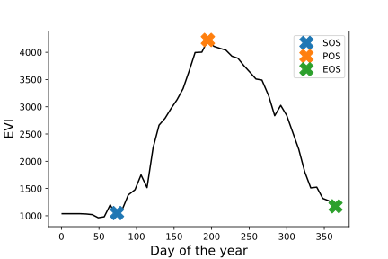

# PhenoPY
<h1 align="center">
<a href='https://github.com/JavierLopatin/PhenoPY'></a>

<h4 align="center">Python bindings for Phenological analysis of Remote Sensing data </h4>

<p align="center">
  <a href="http://forthebadge.com">
    
  </a>
  <a href="http://forthebadge.com"></a>
  <a href="http://forthebadge.com">
      
  </a>
</p>

### Library dependencies:
- Python < 3.6
- rasterstats
- rasterio
- shapely
- pandas
- numpy
- scipy
- matplotlib
- tqdm


### Documentation comming soon...


### Exampe:

This example shows the phenology of wetland vegetation in the San Francisco delta, California, USA, using three consecutive years of Sentinel-2 data. With a total of ~120 observations per pixel, a tipical temporal figure looks like:


As you can see, if you take only yearly data you may end up with many gaps in the data. So, if you are interested in stable land surface phenology (LSP) metrics, you may want to mix several years together to fill the gaps with other years information:

``` python
import phenopy as phen

# coordinates of the pixel to check
X = 584543.89281
Y = 4228482.52520

# plot PhenoShape with multi-year data
phen.PhenoPlot(X=X, Y=Y, inData=inData, dates=dates, ylim=None, type=1,
    rollWindow=3, ylab='EVI')

```


Using multi-year data, `PhenoPy` is able to fill the gaps and fit a single phenological shape from which estimate phenological parameters, such as the start of the season (SOS), the peak of season (POS), and the end of season (EOS). You can check if these values are correctly assessed by using `type=2` in `PhenoPlot`:


``` python

# plot PhenoShape with SOS, POS, and EOS locations
phen.PhenoPlot(X=X, Y=Y, inData=inData, dates=dates, ylim=None, type=1,
    rollWindow=3, ylab='EVI')

```



This is only for visualiyation. A raster of fitted lines per pixel can be achieve:

``` python

phen.PhenoShape(inData=inData, outData=outData, dates=dates,
    nan_replace=-32767, nGS=46, chuckSize=256, n_jobs=4)

```
where `nan_replace` is the NaN value (default None), `nGS` is the munber of interpolation values to use (here we obtained one avarage value per week, hence = 46), `chuckSize` is the size of the chunck that rasterio will open at the time, and `n_jobs` is the number of parallel process to use. We used rasterio to open gib images in smaller sizes and therefore keep the manory usage low.

Meanwhile, a raster of Land Surface Phenology (LSP) metrics can be obtained as:

``` python

phen.PhenoLSP(inData=inData, outData=outData, nGS=46,
  n_jobs=4, chuckSize=256)

```

Until now, the metrics included are:

- SOS - DOY of start of season
- POS - DOY of peak of season
- EOS - DOY of end of season
- vSOS - Value at start of season
- vPOS - Value at peak of season
- vEOS - Value at end of season
- LOS - Length of season (DOY)
- AOS - Amplitude of season (in value units)
- IOS - Integral of season (SOS-EOS)
- ROG - Rate of greening [slope SOS-POS]
- ROS - Rate of senescence [slope POS-EOS]
- SW - Skewness of greening period
