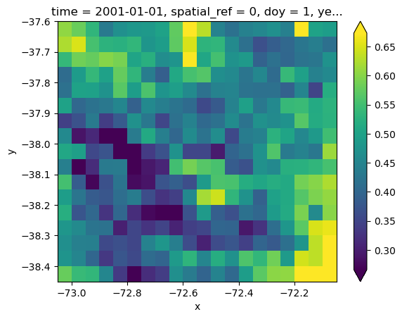
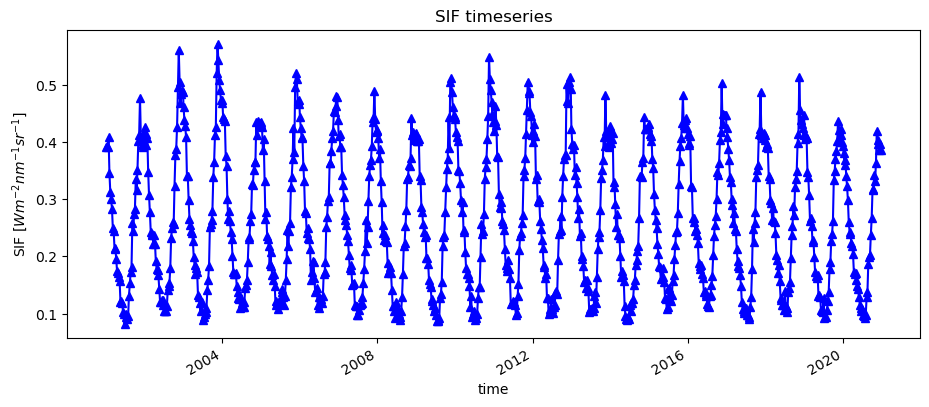
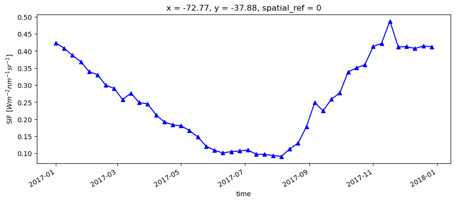
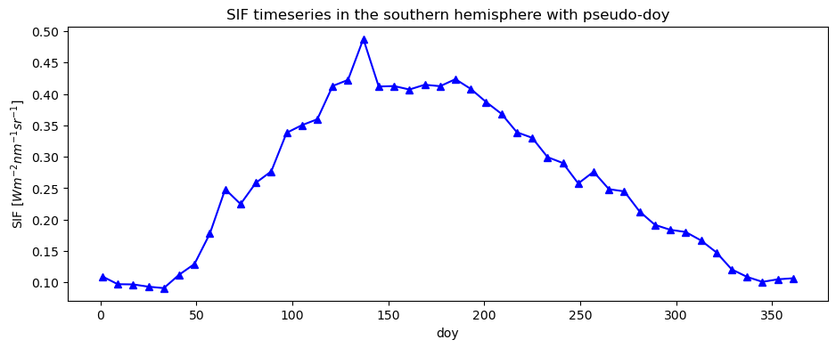
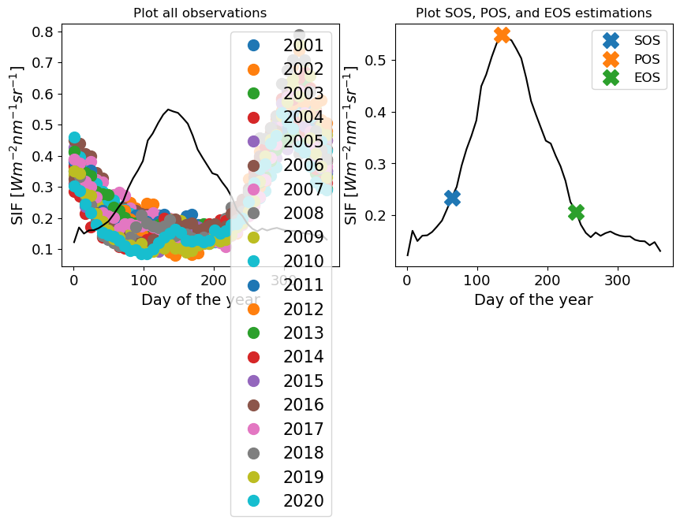
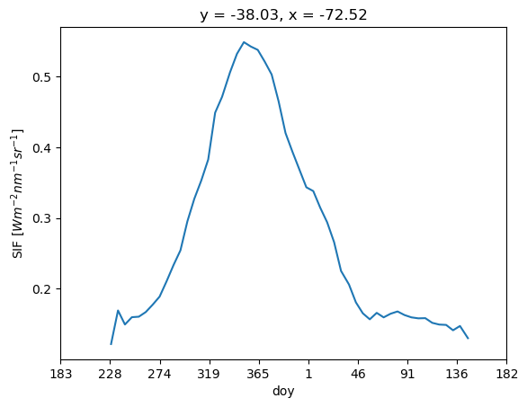
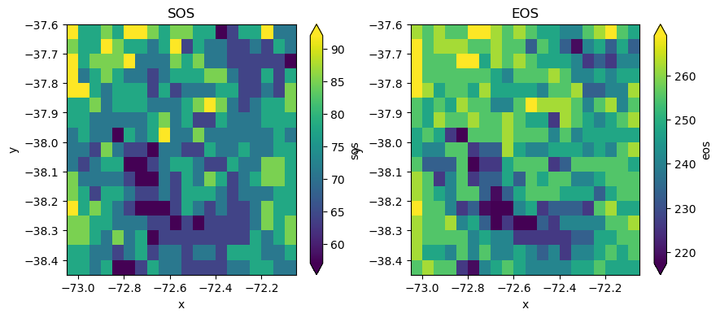
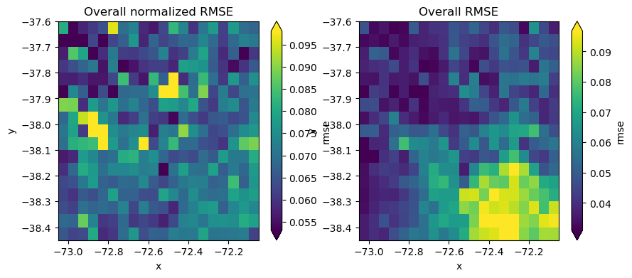
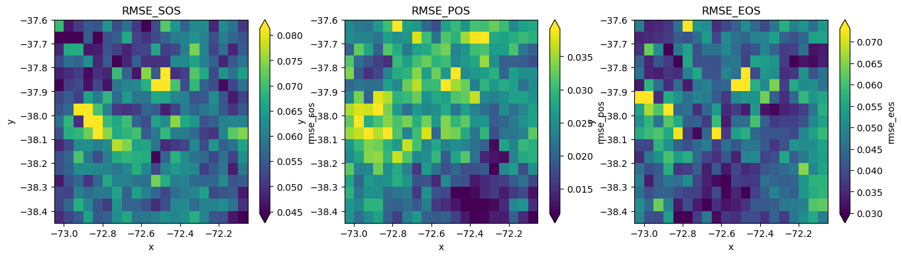
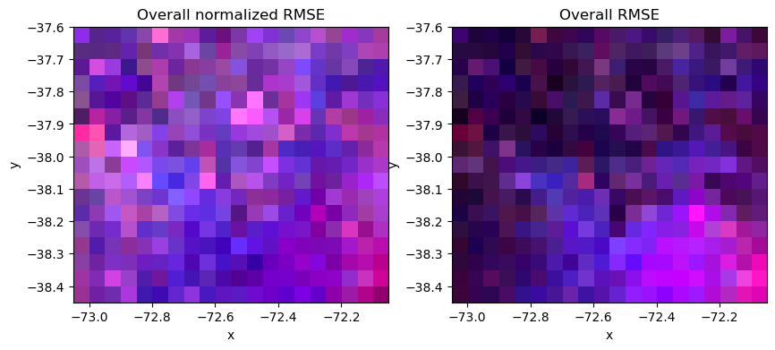

# PhenoPY
<h1 align="center">
<a href='https://github.com/JavierLopatin/PhenoPY'></a>

<h4 align="center">Python bindings for Phenological analysis of Remote Sensing data </h4>

<p align="center">
  <a href="http://forthebadge.com">
    
  </a>
  <a href="http://forthebadge.com"></a>
  <a href="http://forthebadge.com">
      
  </a>
</p>

### Library dependencies:
- Python < 3.6
- rasterstats
- rasterio
- xarrar
- rioxarray
- shapely
- pandas
- numpy
- scipy
- matplotlib
- tqdm


### Documentation comming soon...

### Exampe:

Monthly tome series data of SIF (satellite-retrieved solar-induced  chlorophyll fluorescence) depicted from Chen et al. (2022; https://www.nature.com/articles/s41597-022-01520-1). The area here is a small sample for Chile.

See the Notebook at: https://github.com/JavierLopatin/PhenoPY/blob/master/phenopy/ExampleData.ipynb


```python
import numpy as np
import sys, os
import xarray as xr
import rioxarray as rio
import geopandas as gpd
import matplotlib.pyplot as plt
import pandas as pd

# PhenoPy modules
from phenopy import Pheno
from plotting import plot_with_southern_doy, PhenoPlot

```


```python
# load time data corresponding to the time serie data
days = 'data/SIF_sample_dates.csv'
dates = pd.read_csv(days, header=None)[0]
dates = pd.to_datetime(dates)
dates.head()
```


    0   2001-01-01
    1   2001-01-09
    2   2001-01-17
    3   2001-01-25
    4   2001-02-02
    Name: 0, dtype: datetime64[ns]


```python
inData = 'data/SIF_sample.tif'
img = rio.open_rasterio(inData)

# Check if img is an xarray DataArray
if not hasattr(img, 'assign_coords'):
    raise ValueError("img is not an xarray DataArray")

# Check if dates is defined
if 'dates' not in locals():
    raise ValueError("dates variable is not defined")

# Change 'band' dim to 'time' and assign time values to xarray dimension
img = img.rename({'band': 'time'}).assign_coords(time=dates.values)
# Assign day of year and year
img['doy'] = img.time.dt.dayofyear
img['year'] = img.time.dt.year

```


```python
img.isel(time=0).plot(robust=True)
```


    <matplotlib.collections.QuadMesh at 0x7ff0e67603d0>


    

    


```python
img.isel(x=5, y=5).plot.line('b-^', figsize=(11,4))
plt.title('SIF timeseries')
plt.ylabel('SIF ['r'$Wm^{-2}nm^{-1}sr^{-1}$]')
```


    Text(0, 0.5, 'SIF [$Wm^{-2}nm^{-1}sr^{-1}$]')


    

    


```python
# plot one year time series
img.where(img.year == 2017, drop=True).isel(x=5, y=5).plot.line('b-^', figsize=(11,4))
plt.ylabel('SIF ['r'$Wm^{-2}nm^{-1}sr^{-1}$]')

```


    Text(0, 0.5, 'SIF [$Wm^{-2}nm^{-1}sr^{-1}$]')


    

    


```python
# plot one year time series by doy
img.where(img.year == 2017, drop=True).isel(x=5, y=5).plot.line('b-^', x='doy', figsize=(11,4))
plt.ylabel('SIF ['r'$Wm^{-2}nm^{-1}sr^{-1}$]')

```


    Text(0, 0.5, 'SIF [$Wm^{-2}nm^{-1}sr^{-1}$]')


    

    


As you can see, if you take only yearly data you may end up with many gaps in the data. So, if you are interested in stable land surface phenology (LSP) metrics, you may want to mix several years together to fill the gaps with other years information:


```python
# Use the PhenoPlot funtion with an example X, Y coordinates to play with interpolation parameters.

X = np.median(img.x.values)
Y = np.median(img.y.values)

PhenoPlot(img, X, Y, interpolType='linear', rollWindow=5, plotType=1)
```


    <AxesSubplot: xlabel='Day of the year', ylabel='NDVI'>


    

    


As we are in the souther hemosphere in this case, the typical order of DOY does not give us the necesary phenological shape for rstimating Land Surface Phenology (LSP) metrics.

Hence, we can create pseudo-DOYs for fitting the necesary data and then correct for the real DOY values when plotting.


```python
### Change the DOY order for southern hemisphere

from utils import reorder_southern_hemisphere

reordered_doy, south_img = reorder_southern_hemisphere(img)
```


```python
# plot one year time series by doy in the reordered dataset for southern hemisphere
south_img.where(south_img.year == 2017, drop=True).isel(x=5, y=5).plot.line('b-^', x='doy', figsize=(11,4))
plt.ylabel('SIF ['r'$Wm^{-2}nm^{-1}sr^{-1}$]')
plt.title('SIF timeseries in the southern hemisphere with pseudo-doy')
```


    Text(0.5, 1.0, 'SIF timeseries in the southern hemisphere with pseudo-doy')


    

    


Now we can estimate an interannual phenological shape using all year and heve summer time in the middle of the season.

Using multi-year data, PhenoPy is able to fill the gaps and fit a single phenological shape from which estimate phenological parameters, such as the start of the season (SOS), the peak of season (POS), and the end of season (EOS). You can check if these values are correctly assessed by using type=2 in PhenoPlot:


```python
### TODO: FIX PLOTTING OF DOTS (YEARS) AND INTERPOLATION

# test model parameter using a 2D plot

# example coordinates for testing
X = np.median(img.x.values)
Y = np.median(img.y.values)

fig, axes = plt.subplots(nrows=1, ncols=2, figsize=(10, 4))

# Plot the DataArrays side by side
PhenoPlot(south_img, X, Y, 'linear', rollWindow=5,
          plotType=1, ax=axes[0], ylab='SIF ['r'$Wm^{-2}nm^{-1}sr^{-1}$]')

PhenoPlot(south_img, X, Y, 'linear', rollWindow=5,
          plotType=2, ax=axes[1], ylab='SIF ['r'$Wm^{-2}nm^{-1}sr^{-1}$]')

axes[0].set_title("Plot all observations")
axes[1].set_title("Plot SOS, POS, and EOS estimations")

# Display the plots
plt.show()

```


    

    


Estimate Phenological shape to the raster using the same parameters. Here we are using weekly interpolations (nGS=52), linear interpolation and a rollWindow of 5 for smoothing.


```python
# PhenoShape
shape = img.pheno.PhenoShape(rollWindow=5)
shape_south = south_img.pheno.PhenoShape(rollWindow=5)
```


```python
# plot with selected xy coordinates and use the closest real values if the selected xy is not in the original data
fig, axes = plt.subplots(nrows=1, ncols=2, figsize=(10, 4))

# Plot the DataArrays side by side
shape.sel(x=X, y=Y, method="nearest").plot(ax=axes[0])
shape_south.sel(x=X, y=Y, method="nearest").plot(ax=axes[1])

axes[0].set_title("Without changing hemisphere")
axes[1].set_title("Changing hemisphere")

# Display the plots
plt.show()
```


    

    


```python
# reorder xlabels for southern hemisphere
plot_with_southern_doy(shape_south, coordinates=[X,Y], ylabel='SIF ['r'$Wm^{-2}nm^{-1}sr^{-1}$]')
```


    <AxesSubplot: title={'center': 'y = -38.03, x = -72.52'}, xlabel='doy', ylabel='SIF [$Wm^{-2}nm^{-1}sr^{-1}$]'>


    

    


We can estimate the LSP metrics for the raster. Until now, the metrics included are:

SOS - DOY of Start of season \
POS - DOY of Peak of season \
EOS - DOY of End of season \
vSOS - Vaues at start os season \
vPOS - Values at peak of season \
vEOS - Values at end of season \
LOS - Length of season \
MSP - Mid spring (DOY) \
MAU - Mid autum (DOY) \
vMSP - Value at mean spring \
vMAU - Value at mean autum \
AOS - Amplitude of season \
IOS - Integral of season [SOS-EOS] \
ROG - Rate of greening [slope SOS-POS] \
ROS - Rate of senescence [slope POS-EOS] \
SW - Skewness of growing season [SOS-EOS]


```python
# Land surface phenology metrics (LSP)
lsp = shape_south.pheno.PhenoLSP()
```


```python
# plot lsp.sos.plot(robust=True) and lsp.eos.plot(robust=True) in the same figure
fig, axes = plt.subplots(nrows=1, ncols=2, figsize=(10, 4))

# Plot the DataArrays side by side
lsp.sos.plot(ax=axes[0], robust=True)
lsp.eos.plot(ax=axes[1], robust=True)

axes[0].set_title("SOS")
axes[1].set_title("EOS")

# Display the plots
plt.show()    

```


    

    


We can also estimate the interannual variability of the phenological metrics by calculating the root mean square error of the sognal.

See Lopatin (2023; https://ieeexplore.ieee.org/document/10128132).

E.g., 


```python
rmse = shape.pheno.RMSE(img, LSP_stack=lsp, normalized=True)
rmse2 = shape.pheno.RMSE(img, LSP_stack=lsp, normalized=False)
```


```python
fig, axes = plt.subplots(nrows=1, ncols=2, figsize=(10, 4))

# Plot the DataArrays side by side
rmse.rmse.plot(ax=axes[0], robust=True)
rmse2.rmse.plot(ax=axes[1], robust=True)

axes[0].set_title("Overall normalized RMSE")
axes[1].set_title("Overall RMSE")

# Display the plots
plt.show()   
```


    

    


```python
# plot lsp.sos.plot(robust=True) and lsp.eos.plot(robust=True) in the same figure
fig, axes = plt.subplots(nrows=1, ncols=3, figsize=(16, 4))

# Plot the DataArrays side by side
rmse.rmse_sos.plot(ax=axes[0], robust=True)
rmse.rmse_pos.plot(ax=axes[1], robust=True)
rmse.rmse_eos.plot(ax=axes[2], robust=True)

axes[0].set_title("RMSE_SOS")
axes[1].set_title("RMSE_POS")
axes[2].set_title("RMSE_EOS")

# Display the plots
plt.show()  
```


    

    


```python
# plot RMSE RGB-based figure
fig, axes = plt.subplots(nrows=1, ncols=2, figsize=(10, 4))

# Plot the DataArrays side by side
rmse.to_array()[[3, 2, 1], :, :].plot.imshow(ax=axes[0], robust=True)
rmse2.to_array()[[3, 2, 1], :, :].plot.imshow(ax=axes[1], robust=True)

axes[0].set_title("Overall normalized RMSE")
axes[1].set_title("Overall RMSE")

# Display the plots
plt.show()
```


    

    

